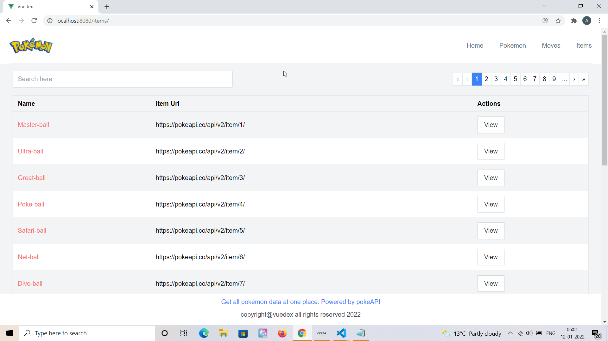

# Vuedex - Pokedex using Vue


## Project Briefing

This is a pokedex app created in Vue Js powered by tailwind css and vue-tailwind package. This app using data from the PokeApi project. Please support them, in my knowledge it's one of the easiest APIs to use with no authentication. 

This app would have information related to 900+ pokemon, 800+ moves and items. Additional features include pagination and search filter.

## Built With

* [Vue JS](https://vuejs.org/)
* [TailwindCSS](https://tailwindcss.com/)
* [Vue-tailwind](https://www.vue-tailwind.com/)

## Authors

* **Amit Prafulla (APFirebolt)** - (https://apgiiit.com/)
## Project setup

This should be a piece of cake for you if you have worked under npm environment before. Simply initialize an empty project using 'npm init' and then install packages. You'd also need to configure .env file in Vue style since I am not uploading env file and Url to fetch pokemon data is contained in the env file. Vue documentation could prove to be very helpful if you are stuck here. Simply clone the project and install dependencies.

I had cors related issues with this API. So, I had to use reverse-proxy through Vue config to simulate the request coming from the same origin.
```
npm install
npm run serve
```
### Compiles and minifies for production
```
npm run build
```

### Lints and fixes files
```
npm run lint
```

## Project Updates

- Express and server script added for Heroku deployment but facing issues with proxy and Pokeapi.
## Project Screenshots

Please find some of the screenshots of the application. First screenshot depicts the homepage of the application with an avatar of 'Pikachu' - the maskot of pokemon.


This shows pokemon detail page with a modal which displays the stats of pokemon,


This screenshot shows the pokemon page of the application where all the pokemon in the pokemon universe are displayed, details page exist for each one of them. Pagination and search filters are applied.



This shows page where list of moves in pokemon universe is depicted.


This shows loader for this application, this would appear as long as data is not available from the API.

